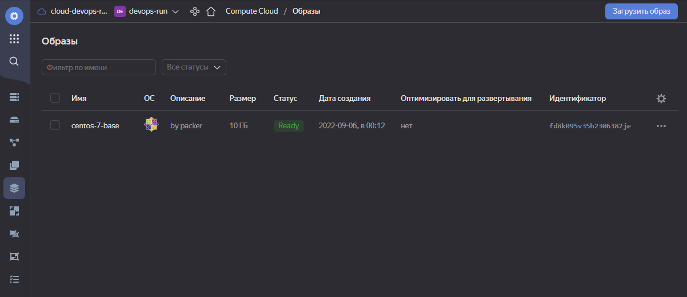
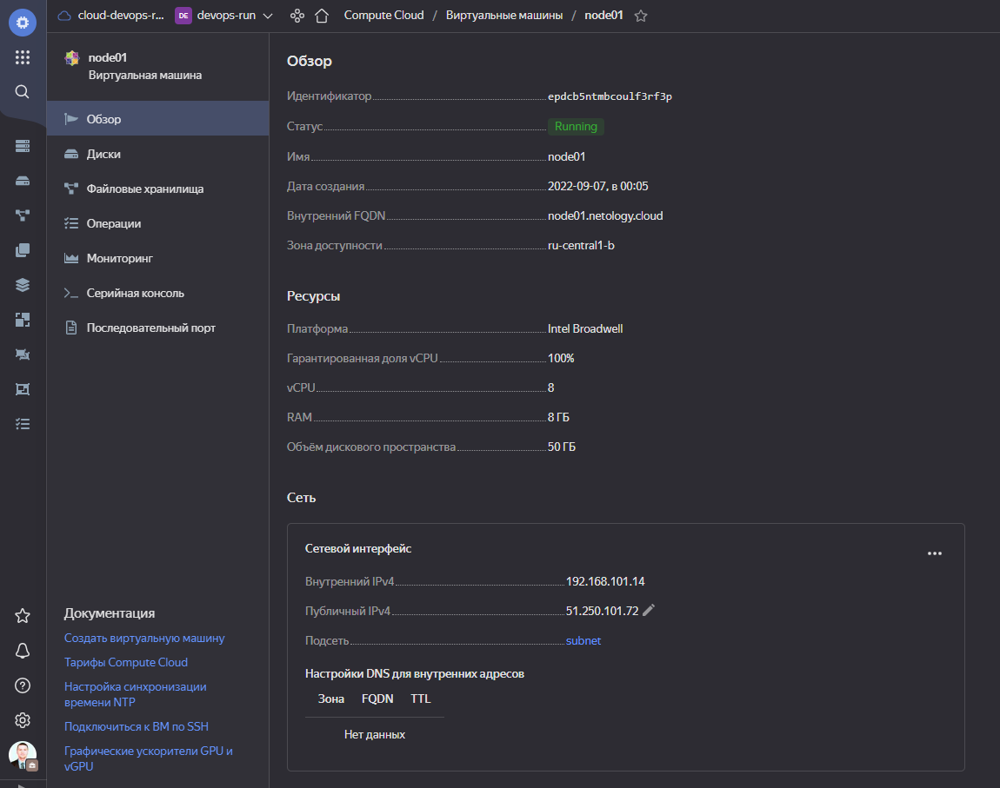
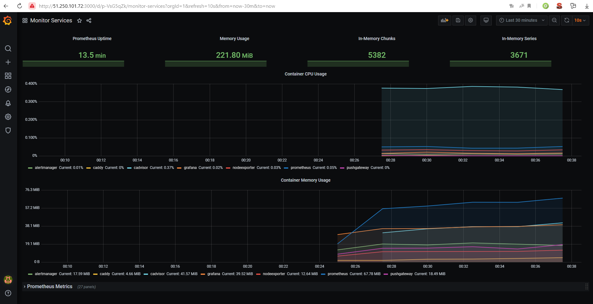
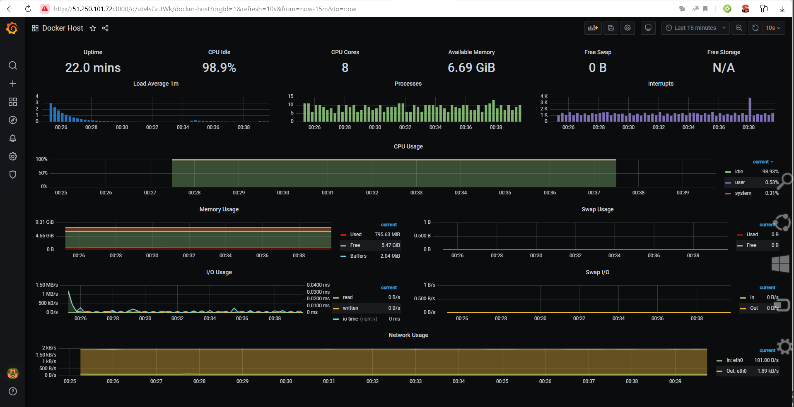
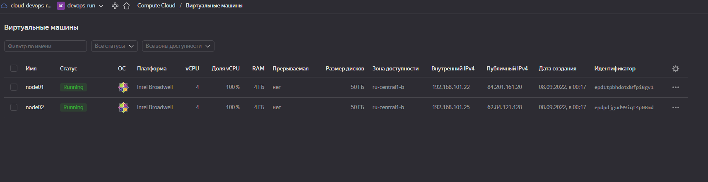
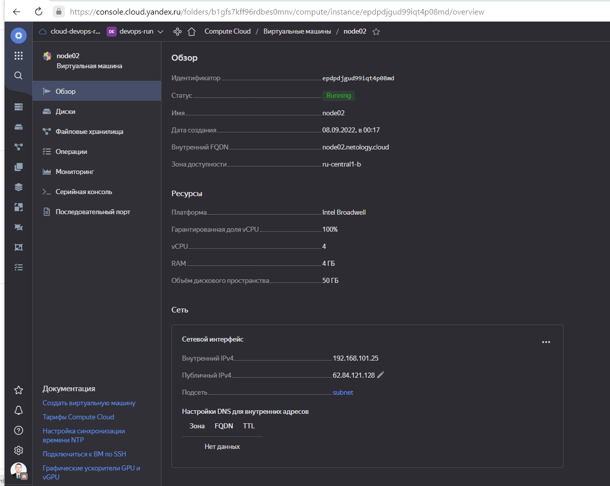
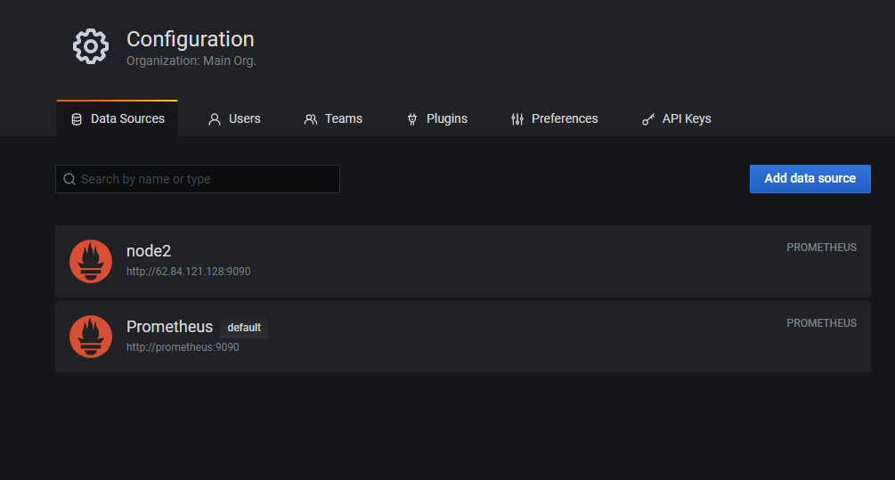

# Домашнее задание к занятию "5.4. Оркестрация группой Docker контейнеров на примере Docker Compose"

## Задача 1

Создать собственный образ операционной системы с помощью Packer.

### Решение

<p align="center"></p>

root@debian11:/packer# yc compute image list
```
+----------------------+---------------+--------+----------------------+--------+
|          ID          |     NAME      | FAMILY |     PRODUCT IDS      | STATUS |
+----------------------+---------------+--------+----------------------+--------+
| fd8k095v35h2306382je | centos-7-base | centos | f2euv1kekdgvc0jrpaet | READY  |
+----------------------+---------------+--------+----------------------+--------+
```

## Задача 2

Создать вашу первую виртуальную машину в Яндекс.Облаке.

### Решение

```
root@debian11:~/yandex-cloud# terraform --version
Terraform v1.2.8
on linux_amd64

```
<p align="center"></p>

## Задача 3

Создать ваш первый готовый к боевой эксплуатации компонент мониторинга, состоящий из стека микросервисов.

### Решение

- Скриншот работающего веб-интерфейса Grafana с текущими метриками

<p align="center"></p>
    
        
<p align="center"></p>

## Задача 4 (*)

Создать вторую ВМ и подключить её к мониторингу развёрнутому на первом сервере.

### Решение

1. Удалил каталог .terraform и файлы .terraform.lock.hcl, terraform.tfstate     
2. Добавил конфигурацию второй vm в файл node02.tf  
3. Проинициализировал заново terraform (terraform init)     
4. Создал 2 вирт. машины в облаке.      
5. "Развернул" docker и сервисы мониторинга на node1 c помощью ansible.
6. Установил Prometheus и node exporter (получилость сделать только подключившись по SSH) на node2


<p align="center"></p>

<p align="center"></p>

<p align="center"></p>

<p align="center"></p>        
---

