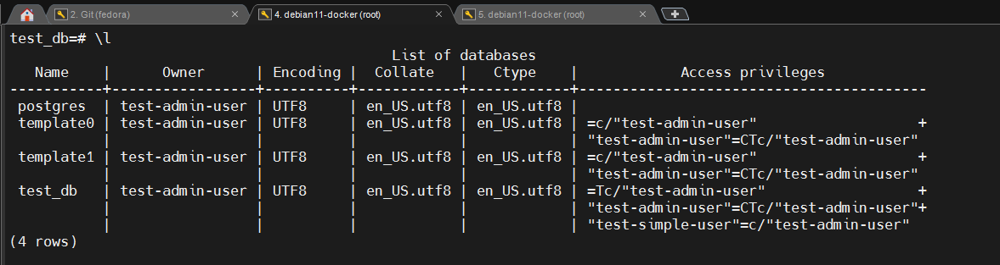
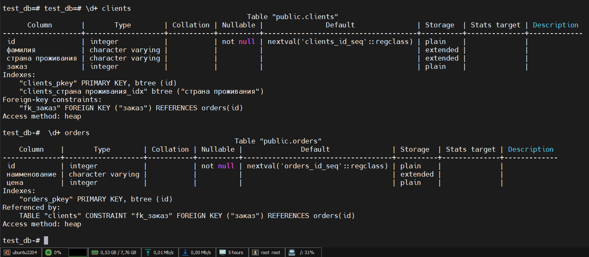

# Домашнее задание к занятию "6.2. SQL"

## Введение

Перед выполнением задания вы можете ознакомиться с 
[дополнительными материалами](https://github.com/netology-code/virt-homeworks/tree/master/additional/README.md).

## Задача 1

Используя docker поднимите инстанс PostgreSQL (версию 12) c 2 volume, 
в который будут складываться данные БД и бэкапы.

Приведите получившуюся команду или docker-compose манифест.

### Решение      

#### docker-compose up -d              

docker-compose.yml
```yaml
version: '3.9'
services:
  postgres:
    image: postgres:12
    container_name: postgres12
    ports:
      - "0.0.0.0:5432:5432"
    volumes:
      - ./data:/var/lib/postgresql/data
      - ./backup:/backup
    environment:
      POSTGRES_USER: "test-admin-user"
      POSTGRES_PASSWORD: "netology"
      POSTGRES_DB: "test_db"
    restart: always
```
     
```bash
root@ubuntu2204:~/postgres# psql -h 127.0.0.1 -U test-admin-user -d test_db
Password for user test-admin-user:
psql (14.5 (Ubuntu 14.5-0ubuntu0.22.04.1), server 12.12 (Debian 12.12-1.pgdg110+1))
Type "help" for help.

test_db=# \l
                                             List of databases
   Name    |      Owner      | Encoding |  Collate   |   Ctype    |            Access privileges
-----------+-----------------+----------+------------+------------+-----------------------------------------
 postgres  | test-admin-user | UTF8     | en_US.utf8 | en_US.utf8 |
 template0 | test-admin-user | UTF8     | en_US.utf8 | en_US.utf8 | =c/"test-admin-user"                   +
           |                 |          |            |            | "test-admin-user"=CTc/"test-admin-user"
 template1 | test-admin-user | UTF8     | en_US.utf8 | en_US.utf8 | =c/"test-admin-user"                   +
           |                 |          |            |            | "test-admin-user"=CTc/"test-admin-user"
 test_db   | test-admin-user | UTF8     | en_US.utf8 | en_US.utf8 |
(4 rows)

test_db=#

```


## Задача 2

В БД из задачи 1: 
- создайте пользователя test-admin-user и БД test_db
- в БД test_db создайте таблицу orders и clients (спeцификация таблиц ниже)
- предоставьте привилегии на все операции пользователю test-admin-user на таблицы БД test_db
- создайте пользователя test-simple-user  
- предоставьте пользователю test-simple-user права на SELECT/INSERT/UPDATE/DELETE данных таблиц БД test_db

Таблица orders:
- id (serial primary key)
- наименование (string)
- цена (integer)

Таблица clients:
- id (serial primary key)
- фамилия (string)
- страна проживания (string, index)
- заказ (foreign key orders)

Приведите:
- итоговый список БД после выполнения пунктов выше,
- описание таблиц (describe)
- SQL-запрос для выдачи списка пользователей с правами над таблицами test_db
- список пользователей с правами над таблицами test_db

### Решение
Подключаемся к базе, создаём таблички       
psql -h 127.0.0.1 -U test-admin-user -d test_db     

```sql
test_db=# CREATE TABLE orders (
    id SERIAL,
    наименование VARCHAR,
    цена INTEGER,
    PRIMARY KEY (id)
);
CREATE TABLE

test_db=# CREATE TABLE clients (
    id SERIAL,
    фамилия VARCHAR,
    "страна проживания" VARCHAR,
    заказ INTEGER,
    PRIMARY KEY (id),
    CONSTRAINT fk_заказ
      FOREIGN KEY(заказ)
            REFERENCES orders(id)
);
CREATE TABLE
```
```
test_db=# CREATE INDEX ON clients("страна проживания");
CREATE INDEX
test_db=# GRANT ALL ON TABLE orders, clients TO "test-admin-user";
GRANT
test_db=# CREATE USER "test-simple-user" WITH PASSWORD 'netology';
CREATE ROLE
test_db=# GRANT CONNECT ON DATABASE test_db TO "test-simple-user";
GRANT
test_db=# GRANT USAGE ON SCHEMA public TO "test-simple-user";
GRANT
test_db=# GRANT SELECT, INSERT, UPDATE, DELETE ON orders, clients TO "test-simple-user";
GRANT
test_db=#
```
#### Листинг всех баз
<p align="center"></p>

#### Сожержание таблиц orders, clients

<p align="center"></p>

#### Вывод SQL запроса c правами юзеров на таблицы      
```
test_db=# SELECT
    grantee, table_name, privilege_type
FROM
    information_schema.table_privileges
WHERE
    grantee in ('test-admin-user','test-simple-user')
    and table_name in ('clients','orders')
order by
    1,2,3;
------------------------------------------------
     grantee      | table_name | privilege_type
------------------+------------+----------------
 test-admin-user  | clients    | DELETE
 test-admin-user  | clients    | INSERT
 test-admin-user  | clients    | REFERENCES
 test-admin-user  | clients    | SELECT
 test-admin-user  | clients    | TRIGGER
 test-admin-user  | clients    | TRUNCATE
 test-admin-user  | clients    | UPDATE
 test-admin-user  | orders     | DELETE
 test-admin-user  | orders     | INSERT
 test-admin-user  | orders     | REFERENCES
 test-admin-user  | orders     | SELECT
 test-admin-user  | orders     | TRIGGER
 test-admin-user  | orders     | TRUNCATE
 test-admin-user  | orders     | UPDATE
 test-simple-user | clients    | DELETE
 test-simple-user | clients    | INSERT
 test-simple-user | clients    | SELECT
 test-simple-user | clients    | UPDATE
 test-simple-user | orders     | DELETE
 test-simple-user | orders     | INSERT
 test-simple-user | orders     | SELECT
 test-simple-user | orders     | UPDATE
(22 rows)

```
## Задача 3

Используя SQL синтаксис - наполните таблицы следующими тестовыми данными:

Таблица orders

|Наименование|цена|
|------------|----|
|Шоколад| 10 |
|Принтер| 3000 |
|Книга| 500 |
|Монитор| 7000|
|Гитара| 4000|

Таблица clients

|ФИО|Страна проживания|
|------------|----|
|Иванов Иван Иванович| USA |
|Петров Петр Петрович| Canada |
|Иоганн Себастьян Бах| Japan |
|Ронни Джеймс Дио| Russia|
|Ritchie Blackmore| Russia|

Используя SQL синтаксис:
- вычислите количество записей для каждой таблицы 
- приведите в ответе:
    - запросы 
    - результаты их выполнения.
#### Решение 
Наполнение базы. (Оператор INSERT вставляет новые записи в таблицу orders)     
```sql
test_db=# INSERT INTO orders VALUES (1, 'Шоколад', 10), (2, 'Принтер', 3000), (3, 'Книга', 500), (4, 'Монитор', 7000), (5, 'Гитара', 4000);
INSERT 0 5
```
Листинг содержимого таблицы orders  

```sql
test_db=# SELECT * FROM orders;
 id | наименование | цена
----+--------------+------
  1 | Шоколад      |   10
  2 | Принтер      | 3000
  3 | Книга        |  500
  4 | Монитор      | 7000
  5 | Гитара       | 4000
(5 rows)

```
Наполнение базы. (Оператор INSERT вставляет новые записи в таблицу clients)

```sql
test_db=# INSERT INTO clients VALUES (1, 'Иванов Иван Иванович', 'USA'), (2, 'Петров Петр Петрович', 'Canada'), (3, 'Иоганн Себастьян Бах', 'Japan'), (4, 'Ронни Джеймс Дио', 'Russia'), (5, 'Ritchie Blackmore', 'Russia');
INSERT 0 5

```
 Листинг содержимого таблицы clients    

```sql
test_db=# SELECT * FROM clients;
 id |       фамилия        | страна проживания | заказ
----+----------------------+-------------------+-------
  1 | Иванов Иван Иванович | USA               |
  2 | Петров Петр Петрович | Canada            |
  3 | Иоганн Себастьян Бах | Japan             |
  4 | Ронни Джеймс Дио     | Russia            |
  5 | Ritchie Blackmore    | Russia            |
(5 rows)

```

## Задача 4

Часть пользователей из таблицы clients решили оформить заказы из таблицы orders.

Используя foreign keys свяжите записи из таблиц, согласно таблице:

|ФИО|Заказ|
|------------|----|
|Иванов Иван Иванович| Книга |
|Петров Петр Петрович| Монитор |
|Иоганн Себастьян Бах| Гитара |

Приведите SQL-запросы для выполнения данных операций.

Приведите SQL-запрос для выдачи всех пользователей, которые совершили заказ, а также вывод данного запроса.
 
Подсказк - используйте директиву `UPDATE`.

#### Решение    

SQL запрос (оператор UPDATE). SQL оператор UPDATE используется для обновления существующих записей в таблицах.      
```sql
test_db=# UPDATE clients SET "заказ" = (SELECT id FROM orders WHERE "наименование"='Книга') WHERE "фамилия"='Иванов Иван Иванович';
UPDATE 1
test_db=# UPDATE clients SET "заказ" = (SELECT id FROM orders WHERE "наименование"='Монитор') WHERE "фамилия"='Петров Петр Петрович';
UPDATE 1
test_db=# UPDATE clients SET "заказ" = (SELECT id FROM orders WHERE "наименование"='Гитара') WHERE "фамилия"='Иоганн Себастьян Бах';
UPDATE 1

```

```sql
test_db=# SELECT * FROM clients c JOIN orders o ON c.заказ = o.id;
 id |       фамилия        | страна проживания | заказ | id | наименование | цена
----+----------------------+-------------------+-------+----+--------------+------
  1 | Иванов Иван Иванович | USA               |     3 |  3 | Книга        |  500
  2 | Петров Петр Петрович | Canada            |     4 |  4 | Монитор      | 7000
  3 | Иоганн Себастьян Бах | Japan             |     5 |  5 | Гитара       | 4000

```

## Задача 5

Получите полную информацию по выполнению запроса выдачи всех пользователей из задачи 4 
(используя директиву EXPLAIN).

Приведите получившийся результат и объясните что значат полученные значения.

#### Решение

```sql
test_db=# EXPLAIN ANALYZE SELECT * FROM clients c JOIN orders o ON c.заказ = o.id;
                                                    QUERY PLAN
-------------------------------------------------------------------------------------------------------------------
 Hash Join  (cost=37.00..57.24 rows=810 width=112) (actual time=0.015..0.016 rows=3 loops=1)
   Hash Cond: (c."заказ" = o.id)
   ->  Seq Scan on clients c  (cost=0.00..18.10 rows=810 width=72) (actual time=0.005..0.006 rows=5 loops=1)
   ->  Hash  (cost=22.00..22.00 rows=1200 width=40) (actual time=0.004..0.005 rows=5 loops=1)
         Buckets: 2048  Batches: 1  Memory Usage: 17kB
         ->  Seq Scan on orders o  (cost=0.00..22.00 rows=1200 width=40) (actual time=0.002..0.002 rows=5 loops=1)
 Planning Time: 0.075 ms
 Execution Time: 0.027 ms
(8 rows)


```

Числа, перечисленные в скобках (слева направо), имеют следующий смысл:      

Приблизительная стоимость запуска. Это время, которое проходит, прежде чем начнётся этап вывода данных, например для сортирующего узла это время сортировки.        
        
Приблизительная общая стоимость. Она вычисляется в предположении, что узел плана выполняется до конца, то есть возвращает все доступные строки. На практике родительский узел может досрочно прекратить чтение строк дочернего.     
        
Ожидаемое число строк, которое должен вывести этот узел плана. При этом так же предполагается, что узел выполняется до конца.       
        
Ожидаемый средний размер строк, выводимых этим узлом плана (в байтах).      

использовал информацию с https://postgrespro.ru/docs/postgrespro/12/using-explain  

## Задача 6

Создайте бэкап БД test_db и поместите его в volume, предназначенный для бэкапов (см. Задачу 1).

Остановите контейнер с PostgreSQL (но не удаляйте volumes).

Поднимите новый пустой контейнер с PostgreSQL.

Восстановите БД test_db в новом контейнере.

Приведите список операций, который вы применяли для бэкапа данных и восстановления. 

#### Решение 
   
```bash 

root@ubuntu2204:~/postgres# pwd
/root/postgres
root@ubuntu2204:~/postgres# export PGPASSWORD=netology && pg_dumpall -h localhost -U test-admin-user > ./backup/dumpall.sql
root@ubuntu2204:~/postgres#
```

```bash
oot@ubuntu2204:~/postgres# docker ps -a
CONTAINER ID   IMAGE         COMMAND                  CREATED       STATUS       PORTS                    NAMES
405d954def79   postgres:12   "docker-entrypoint.s…"   3 hours ago   Up 3 hours   0.0.0.0:5432->5432/tcp   postgres12
root@ubuntu2204:~/postgres#

```

```bash
root@ubuntu2204:~/postgres# docker container stop postgres12
postgres12
```
```bash
root@ubuntu2204:~/postgres# docker run -d -e POSTGRES_USER=test-admin-user -e POSTGRES_PASSWORD=netology -e POSTGRES_DB=test_db --name postgres12-from_backup postgres:12
d5fd9b137f068fb70e20981ff031bc87ba05e8c3dc4c2e38bb77f67b2fc903c6
root@ubuntu2204:~/postgres# docker ps
CONTAINER ID   IMAGE         COMMAND                  CREATED         STATUS         PORTS      NAMES
d5fd9b137f06   postgres:12   "docker-entrypoint.s…"   8 seconds ago   Up 7 seconds   5432/tcp   postgres12-from_backup
root@ubuntu2204:~/postgres#
```


