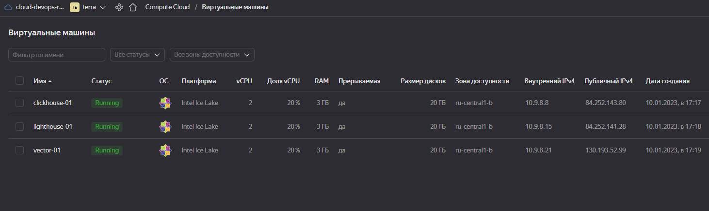

# Домашнее задание к занятию "3. Использование Yandex Cloud"

## Подготовка к выполнению

1. Подготовьте в Yandex Cloud три хоста: для `clickhouse`, для `vector` и для `lighthouse`.     
Выполнено:  
 


Ссылка на репозиторий LightHouse: https://github.com/VKCOM/lighthouse

## Основная часть

1. Допишите playbook: нужно сделать ещё один play, который устанавливает и настраивает lighthouse.

2. При создании tasks рекомендую использовать модули: `get_url`, `template`, `yum`, `apt`.
3. Tasks должны: скачать статику lighthouse, установить nginx или любой другой webserver, настроить его конфиг для открытия lighthouse, запустить webserver.

4. Приготовьте свой собственный inventory файл `prod.yml`.
Выполнено:  
5. Запустите `ansible-lint site.yml` и исправьте ошибки, если они есть.
Сделано:    
6. Попробуйте запустить playbook на этом окружении с флагом `--check`.
```bash
ansible-work playbook]$ ansible-playbook -i inventory/prod.yml site.yml --check

PLAY [Install Nginx] *************************************************************************************************************************

TASK [Gathering Facts] ***********************************************************************************************************************
ok: [lighthouse-01]
ok: [vector-01]

TASK [NGINX | Install eper-release] **********************************************************************************************************
changed: [lighthouse-01]
changed: [vector-01]

TASK [NGINX | Install Nginx] *****************************************************************************************************************
fatal: [lighthouse-01]: FAILED! => {"changed": false, "msg": "No package matching 'nginx' found available, installed or updated", "rc": 126, "results": ["No package matching 'nginx' found available, installed or updated"]}
fatal: [vector-01]: FAILED! => {"changed": false, "msg": "No package matching 'nginx' found available, installed or updated", "rc": 126, "results": ["No package matching 'nginx' found available, installed or updated"]}

PLAY RECAP ***********************************************************************************************************************************
lighthouse-01              : ok=2    changed=1    unreachable=0    failed=1    skipped=0    rescued=0    ignored=0
vector-01                  : ok=2    changed=1    unreachable=0    failed=1    skipped=0    rescued=0    ignored=0

```
7. Запустите playbook на `prod.yml` окружении с флагом `--diff`. Убедитесь, что изменения на системе произведены.
последние строки вывода:        

```bash

TASK [VECTOR | Create systemd unit] **********************************************************************************************************
--- before
+++ after: /home/*****/.ansible/tmp/ansible-local-25142vjsdi_xw/tmpsc5jw62b/vector.service.j2
@@ -0,0 +1,12 @@
+[Unit]
+Description=Vector service
+After=network.target
+Requires=network-online.target
+[Service]
+User=root
+Group=root
+ExecStart=/usr/bin/vector --config-yaml /etc/vector/vector.yml
+Restart=always
+[Install]
+WantedBy=multi-user.target
+

changed: [vector-01]

TASK [VECTOR | Start service] ****************************************************************************************************************
changed: [vector-01]

PLAY RECAP ***********************************************************************************************************************************
clickhouse-01              : ok=11   changed=9    unreachable=0    failed=0    skipped=0    rescued=0    ignored=0
lighthouse-01              : ok=11   changed=9    unreachable=0    failed=0    skipped=0    rescued=0    ignored=0
vector-01                  : ok=12   changed=9    unreachable=0    failed=0    skipped=0    rescued=0    ignored=0

```

8. Повторно запустите playbook с флагом `--diff` и убедитесь, что playbook идемпотентен.
```bash
PLAY RECAP ***********************************************************************************************************************************
clickhouse-01              : ok=9    changed=1    unreachable=0    failed=0    skipped=0    rescued=0    ignored=0
lighthouse-01              : ok=8    changed=0    unreachable=0    failed=0    skipped=0    rescued=0    ignored=0
vector-01                  : ok=10   changed=0    unreachable=0    failed=0    skipped=0    rescued=0    ignored=0

```
9. Подготовьте README.md файл по своему playbook. В нём должно быть описано: что делает playbook, какие у него есть параметры и теги.

10. Готовый playbook выложите в свой репозиторий, поставьте тег `08-ansible-03-yandex` на фиксирующий коммит, в ответ предоставьте ссылку на него.

---

